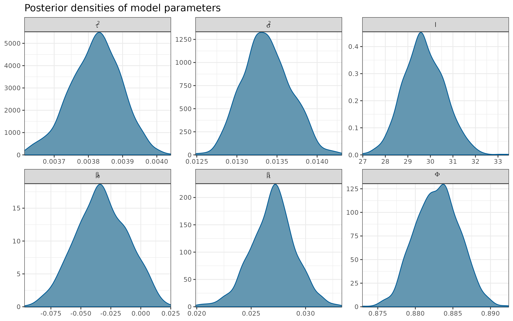
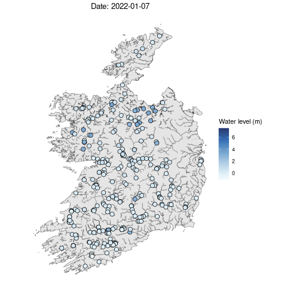

```{r, cache=FALSE, include=FALSE}
options(htmltools.dir.version = FALSE)

source("config/setup_knitr.R")
library(RefManageR)
BibOptions(check.entries = FALSE,
           bib.style = "authoryear",
           cite.style = "authoryear",
           style = "markdown",
           max.names = 2,
           hyperlink = FALSE,
           dashed = FALSE)
bib <- ReadBib("config/refs.bib", check = FALSE)
xaringanExtra::use_xaringan_extra("tachyons")

library(plotly)
```

class: title-slide, sydney-blue
background-image: url("config/CRT_uni_funding.png"), url("config/CRT_logo.png")
background-position: 10% 100%, 85% 99%
background-size: 47%, 30%

<br>
.center[.font200[.white[Spatiotemporal prediction of daily river levels in Ireland using nearest neighbor Gaussian processes]]]

<br>
.center[.white[
.large[Victor Nagahama<sup>1</sup> James Sweeney<sup>2</sup> Niamh Cahill<sup>1</sup>]

.small[<sup>1</sup>Maynooth University <sup>2</sup>University of Limerick]

<br>
21/06/2024
]]

---
count: false
# Motivation

.pull-left[

]

.pull-right[
]

---
count: false
# Motivation

.pull-left[

]

.pull-right[
```{r, echo=FALSE, out.width='100%'}

```
]

---
# Gaussian Process

Consider a zero-centered spatial process $\boldsymbol{y}(\boldsymbol{s})$ in the spatial domain $\mathcal{S} \subset \mathcal{R}^d$ for the reference locations $\boldsymbol{s} = \{\mathcal{s}_1, \dots, \mathcal{s}_n\}$. The multivariate density can be factorized as  

$$p(\boldsymbol{y}) = p(y(\boldsymbol{s}_1)) \prod_{i = 2}^n p(y(\boldsymbol{s}_i) \mid y(\boldsymbol{s}_1), \dots, y(\boldsymbol{s}_{i - 1}))$$

--
## Nearest Neighbor Gaussian Process (NNGP)

For a large number of spatial points, the conditional densities have superfluous information in a way it can be equivalent to condition by smaller sets `r Citep(bib, c("Vecchia1988", "Datta2016"))`.

$$p(\boldsymbol{y}) \approx p(\widetilde{\boldsymbol{y}}) = p(y(\boldsymbol{s}_1)) \prod_{i = 2}^n p(y(\boldsymbol{s}_i) \mid y(N(\mathcal{s}_i)))$$
where $N(\boldsymbol{s}_i)$ is the subset with at most $m$ nearest neighbors of $\boldsymbol{s}_i$ in $\boldsymbol{s}_i = \{\boldsymbol{s}_1, \dots, \boldsymbol{s}_{i - 1}\}$.

---
# Steps

```{r, echo=FALSE}
plot_cond_set <- readRDS("./data/conditional_set.rds")
```

.pull-left[
```{r, plot_cond_set, cache=TRUE}
ggplotly(plot_cond_set, height = 520, width = 500) |>
  animation_opts(
    frame = 1500,
    transition = 0,
    redraw = FALSE
  ) |>
  animation_slider(currentvalue = list(prefix = "Location ",
                                       font = list(color = "black"))) |>
  config(staticPlot = TRUE)
```
]

.pull-right[
1. Order the locations (according to one of the coordinates)
]

---
count: false
# Steps

.pull-left[
```{r, plot_cond_set}
```
]

.pull-right[
1. Order the locations (according to one of the coordinates)
2. Find the neighbor sets $N(\boldsymbol{s}_i)$
]

---
count: false
# Steps

.pull-left[
```{r, plot_cond_set}
```
]

.pull-right[
1. Order the locations (according to one of the coordinates)
2. Find the neighbor sets $N(\boldsymbol{s}_i)$
3. Compute the conditional densities
$$p(y(\boldsymbol{s}_i) \mid \boldsymbol{y}(N(\boldsymbol{s}_i))) \sim \mathcal{N} \left( \boldsymbol{a}_i \boldsymbol{y} \left( N(\boldsymbol{s}_i) \right), d_i \right) \\
\boldsymbol{a}_i = \boldsymbol{\Sigma}_{\boldsymbol{s}_i, N(\boldsymbol{s}_i)} \boldsymbol{\Sigma}^{-1}_{N(\boldsymbol{s}_i)} \\
d_i = \boldsymbol{\Sigma}_{\boldsymbol{s}_i} - \boldsymbol{a}_i \boldsymbol{\Sigma}^\intercal_{\boldsymbol{s}_i, N(\boldsymbol{s}_i)}$$
]

---
count: false

# Steps
.pull-left[
```{r, plot_cond_set}
```
]

.pull-right[
1. Order the locations (according to one of the coordinates)
2. Find the neighbor sets $N(\boldsymbol{s}_i)$
3. Compute the conditional densities
$$p(y(\boldsymbol{s}_i) \mid \boldsymbol{y}(N(\boldsymbol{s}_i))) \sim \mathcal{N} \left( \boldsymbol{a}_i \boldsymbol{y} \left( N(\boldsymbol{s}_i) \right), d_i \right) \\
\boldsymbol{a}_i = \boldsymbol{\Sigma}_{\boldsymbol{s}_i, N(\boldsymbol{s}_i)} \boldsymbol{\Sigma}^{-1}_{N(\boldsymbol{s}_i)} \\
d_i = \boldsymbol{\Sigma}_{\boldsymbol{s}_i} - \boldsymbol{a}_i \boldsymbol{\Sigma}^\intercal_{\boldsymbol{s}_i, N(\boldsymbol{s}_i)}$$
4. Obtain the approximation for $p(\boldsymbol{y})$
$$p(\widetilde{\boldsymbol{y}}) = p(y(\boldsymbol{s}_1)) \prod_{i = 2}^n p(y(\boldsymbol{s}_i) \mid y(N(\mathcal{s}_i)))$$
]


---
count: false

# Steps
.pull-left[
```{r, plot_cond_set}
```
]

.pull-right[
1. Order the locations (according to one of the coordinates)
2. Find the neighbor sets $N(\boldsymbol{s}_i)$
3. Compute the conditional densities
$$p(y(\boldsymbol{s}_i) \mid \boldsymbol{y}(N(\boldsymbol{s}_i))) \sim \mathcal{N} \left( \boldsymbol{a}_i \boldsymbol{y} \left( N(\boldsymbol{s}_i) \right), d_i \right) \\
\boldsymbol{a}_i = \boldsymbol{\Sigma}_{\boldsymbol{s}_i, N(\boldsymbol{s}_i)} \boldsymbol{\Sigma}^{-1}_{N(\boldsymbol{s}_i)} \\
d_i = \boldsymbol{\Sigma}_{\boldsymbol{s}_i} - \boldsymbol{a}_i \boldsymbol{\Sigma}^\intercal_{\boldsymbol{s}_i, N(\boldsymbol{s}_i)}$$
4. Obtain the approximation for $p(\boldsymbol{y})$
$$p(\widetilde{\boldsymbol{y}}) = p(y(\boldsymbol{s}_1)) \prod_{i = 2}^n p(y(\boldsymbol{s}_i) \mid y(N(\mathcal{s}_i)))$$

Computational cost of $\mathcal{O}(n \times m^2)$ instead of $\mathcal{O}(n^3)$
]

---
# Ireland river data

- 301 river stations
- 07/01/2022 to 06/04/2022 (90 daily records)
- Response variable: water level above the mean level (centered variable)

--

- Out-of-sample evaluation:
    - 20 random spatial locations with all times left out (interpolation)
    - The last 3 days of all spatial locations were left out (forecast) 

--

```{r, echo=FALSE, out.width='50%'}
knitr::include_graphics("./figures/water_rain.png")
```

---
count: false

# Proposed model

Let $\boldsymbol{y}_t$ represent the vector of water level measurements from all available stations at time $t$. 

$$\boldsymbol{y}_t \mid \boldsymbol{y}_{t - 1}, \boldsymbol{X}_t, \boldsymbol{\theta} \sim \mathcal{N}(\boldsymbol{\mu}_t, \boldsymbol{\Sigma}^\star) \\
\boldsymbol{\mu}_t = \boldsymbol{X}_t \boldsymbol{\beta} + \phi (\boldsymbol{y}_{t - 1} - \boldsymbol{X}_{t - 1} \boldsymbol{\beta}) \\
\boldsymbol{\Sigma}^\star = \boldsymbol{\Sigma} + \tau^2 \boldsymbol{I}\\
\boldsymbol{\theta} = (\tau^2, \sigma^2, l, \beta_0, \beta_1, \phi)$$

---
count: false

# Proposed model

Let $\boldsymbol{y}_t$ represent the vector of water level measurements from all available stations at time $t$.

$$\boldsymbol{y}_t \mid \boldsymbol{y}_{t - 1}, \boldsymbol{X}_t, \boldsymbol{\theta} \sim \mathcal{N}(\boldsymbol{\mu}_t, \boldsymbol{\Sigma}^\star) \\
\boldsymbol{\mu}_t = \boldsymbol{X}_t \boldsymbol{\beta} + \phi (\boldsymbol{y}_{t - 1} - \boldsymbol{X}_{t - 1} \boldsymbol{\beta}) \\
\boldsymbol{\Sigma}^\star = \boldsymbol{\Sigma} + \tau^2 \boldsymbol{I}\\
\boldsymbol{\theta} = (\tau^2, \sigma^2, l, \beta_0, \beta_1, \phi)$$

- In this model we integrated out the spatial process obtaining the marginal model
- $\boldsymbol{\Sigma}$ is the covariance matrix from the spatial process which follows a NNGP prior

---
count: false

# Proposed model

Let $\boldsymbol{y}_t$ represent the vector of water level measurements from all available stations at time $t$.

$$\boldsymbol{y}_t \mid \boldsymbol{y}_{t - 1}, \boldsymbol{X}_t, \boldsymbol{\theta} \sim \mathcal{N}(\boldsymbol{\mu}_t, \boldsymbol{\Sigma}^\star) \\
\boldsymbol{\mu}_t = \boldsymbol{X}_t \boldsymbol{\beta} + \phi (\boldsymbol{y}_{t - 1} - \boldsymbol{X}_{t - 1} \boldsymbol{\beta}) \\
\boldsymbol{\Sigma}^\star = \boldsymbol{\Sigma} + \tau^2 \boldsymbol{I}\\
\boldsymbol{\theta} = (\tau^2, \sigma^2, l, \beta_0, \beta_1, \phi)$$

- In this model we integrated out the spatial process obtaining the marginal model
- $\boldsymbol{\Sigma}$ is the covariance matrix from the spatial process which follows a NNGP prior
- Bayesian Inference and implementation using Stan

---
count: false

# Proposed model

Let $\boldsymbol{y}_t$ represent the vector of water level measurements from all available stations at time $t$.

$$\boldsymbol{y}_t \mid \boldsymbol{y}_{t - 1}, \boldsymbol{X}_t, \boldsymbol{\theta} \sim \mathcal{N}(\boldsymbol{\mu}_t, \boldsymbol{\Sigma}^\star) \\
\boldsymbol{\mu}_t = \boldsymbol{X}_t \boldsymbol{\beta} + \phi (\boldsymbol{y}_{t - 1} - \boldsymbol{X}_{t - 1} \boldsymbol{\beta}) \\
\boldsymbol{\Sigma}^\star = \boldsymbol{\Sigma} + \tau^2 \boldsymbol{I}\\
\boldsymbol{\theta} = (\tau^2, \sigma^2, l, \beta_0, \beta_1, \phi)$$

- In this model we integrated out the spatial process obtaining the marginal model
- $\boldsymbol{\Sigma}$ is the covariance matrix from the spatial process which follows a NNGP prior
- Bayesian Inference and implementation using Stan

<br><br>
Extension to spatially varying slopes: $\beta_1 \sim \mathcal{N}(b_1, \boldsymbol{\Sigma}_{\beta_1})$

---
count: false

# Proposed model

Let $\boldsymbol{y}_t$ represent the vector of water level measurements from all available stations at time $t$.

$$\boldsymbol{y}_t \mid \boldsymbol{y}_{t - 1}, \boldsymbol{X}_t, \boldsymbol{\theta} \sim \mathcal{N}(\boldsymbol{\mu}_t, \boldsymbol{\Sigma}^\star) \\
\boldsymbol{\mu}_t = \boldsymbol{X}_t \boldsymbol{\beta} + \phi (\boldsymbol{y}_{t - 1} - \boldsymbol{X}_{t - 1} \boldsymbol{\beta}) \\
\boldsymbol{\Sigma}^\star = \boldsymbol{\Sigma} + \tau^2 \boldsymbol{I}\\
\boldsymbol{\theta} = (\tau^2, \sigma^2, l, \beta_0, \beta_1, \phi)$$

- In this model we integrated out the spatial process obtaining the marginal model
- $\boldsymbol{\Sigma}$ is the covariance matrix from the spatial process which follows a NNGP prior
- Bayesian Inference and implementation using Stan

<br><br>
Extension to spatially varying slopes: $\beta_1 \sim \mathcal{N}(b_1, \boldsymbol{\Sigma}_{\beta_1})$ &nbsp;&nbsp;&nbsp; `r icons::icon_style(icons::fontawesome("times"), scale = 1, fill = "red")`

---
count: false

# Proposed model

Let $\boldsymbol{y}_t$ represent the vector of water level measurements from all available stations at time $t$.

.content-box-green[
$$\boldsymbol{y}_t \mid \boldsymbol{y}_{t - 1}, \boldsymbol{X}_t, \boldsymbol{\theta} \sim \mathcal{N}(\boldsymbol{\mu}_t, \boldsymbol{\Sigma}^\star) \\
\boldsymbol{\mu}_t = \boldsymbol{X}_t \boldsymbol{\beta} + \phi (\boldsymbol{y}_{t - 1} - \boldsymbol{X}_{t - 1} \boldsymbol{\beta}) \\
\boldsymbol{\Sigma}^\star = \boldsymbol{\Sigma} + \tau^2 \boldsymbol{I}\\
\boldsymbol{\theta} = (\tau^2, \sigma^2, l, \beta_0, \beta_1, \phi)$$
]

- In this model we integrated out the spatial process obtaining the marginal model
- $\boldsymbol{\Sigma}$ is the covariance matrix from the spatial process which follows a NNGP prior
- Bayesian Inference and implementation using Stan

<br><br>
Extension to spatially varying slopes: $\beta_1 \sim \mathcal{N}(b_1, \boldsymbol{\Sigma}_{\beta_1})$ &nbsp;&nbsp;&nbsp; `r icons::icon_style(icons::fontawesome("times"), scale = 1, fill = "red")`

---
# Posterior densities of model parameters

```{r, echo=FALSE, out.width='80%'}

```

---
# Out-of-sample prediction

```{r, echo=FALSE, out.width='85%'}
knitr::include_graphics("./figures/predicted_observed.png")
```

---
# Out-of-sample prediction

```{r, echo=FALSE, out.width='80%'}
knitr::include_graphics("./figures/ts_pred.png")
```

---
# Future work

- Include additional predictors such as evaporation and soil saturation.

--
- Consider nonlinear functions to improve the relationship between response and predictors

--
- Incorporate covariance structures that considers the branching stream network and flow connectivity `r Citep(bib, "VerHoef2010")`

---
# References
```{r, results='asis'}
PrintBibliography(bib)
```

---
class: sydney-blue, middle, inverse
# .white[Thank you!]

.pull-left[.pull-down[
<a href="mailto:victor.nagahama.2022@mumail.ie">
.white[`r icons::fontawesome("paper-plane")` victor.nagahama.2022@mumail.ie]
</a>

<a href="https://nagahamavh.github.io/geoenv24">
.white[`r icons::fontawesome("link")` nagahamavh.github.io/geoenv24]
</a>

<a href="http://github.com/nagahamaVH">
.white[`r icons::fontawesome("github")` @nagahamaVH]
</a>

<br><br><br><br><br>
]]

.pull-right[

]
