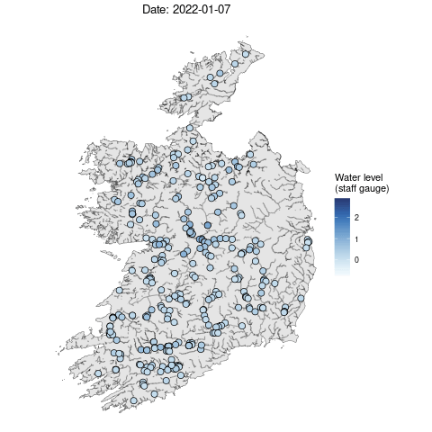

```{r, cache=FALSE, include=FALSE}
source("config/setup_knitr.R")
library(RefManageR)
BibOptions(check.entries = FALSE,
           bib.style = "authoryear",
           cite.style = "authoryear",
           style = "markdown",
           hyperlink = FALSE,
           dashed = FALSE)
bib <- ReadBib("config/refs.bib", check = FALSE)
xaringanExtra::use_xaringan_extra("tachyons")

library(plotly)
```

class: title-slide, sydney-blue
background-image: url("config/CRT_uni_funding.png"), url("config/CRT_logo.png")
background-position: 10% 100%, 85% 99%
background-size: 47%, 30%

<br>
.center[.font200[.white[Spatiotemporal prediction of daily river levels in Ireland using nearest neighbor Gaussian processes]]]

<br>
.center[.black[
.large[Victor Nagahama<sup>1</sup> Niamh Cahill<sup>1</sup> James Sweeney<sup>2</sup>]

.small[<sup>1</sup>Maynooth University <sup>2</sup>University of Limerick]

<br>
19/05/2024
]]

---

# Outline

- Motivation
- Nearest Neighbor Gaussian Process (NNGP)
- Deep look into Ireland river data
- Proposed models
- Results
- Future work
---

# Motivation
.pull-left[

]

.pull-right[
- 291 river stations
- 01/03/2022 to 03/03/2023 (XXX daily records)
- Auxiliary variables: rainfall
]
---

# Gaussian Process

Consider a (Gaussian) spatial process $\boldsymbol{x}(\boldsymbol{s})$ in the spatial domain $\mathcal{S} \subset \mathcal{R}^d$ for the reference locations $\boldsymbol{s} = \{\mathcal{s}_1, \dots, \mathcal{s}_n\}$. The multivariate density can be factorized as  

$$p(\boldsymbol{x}) = p(x(\boldsymbol{s}_1)) \prod_{i = 2}^n p(x(\boldsymbol{s}_i) \mid x(\boldsymbol{s}_1), \dots, x(\boldsymbol{s}_{i - 1}))$$
--

## Nearest Neighbor Gaussian Process (NNGP)

For a large number of spatial points, the conditional densities have superfluous information in a way it can be equivalent to condition by smaller sets (Vecchia, 1988; Datta, et al., 2016).

$$p(\boldsymbol{x}) \approx p(\widetilde{\boldsymbol{x}}) = p(x(\boldsymbol{s}_1)) \prod_{i = 2}^n p(x(\boldsymbol{s}_i) \mid x(N(\mathcal{s}_i)))$$
where $N(\boldsymbol{s}_i)$ is the subset with at most $m$ nearest neighbors of $\boldsymbol{s}_i$ in $\boldsymbol{s}_i = \{\boldsymbol{s}_1, \dots, \boldsymbol{s}_{i - 1}\}$.
---

# Steps 

.pull-left[
1. Order the locations
2. Find the neighbor sets
3. Compute the conditional densities

$$p(x(\boldsymbol{s}_i) \mid \boldsymbol{x}(N(\boldsymbol{s}_i)) \sim \mathcal{N} \left( \boldsymbol{a}_i \boldsymbol{x} \left( N(\boldsymbol{s}_i) \right), d_i \right) \\
\boldsymbol{a}_i = \boldsymbol{C}_{\boldsymbol{s}_i, N(\boldsymbol{s}_i)} \boldsymbol{C}^{-1}_{N(\boldsymbol{s}_i)} \\
d_i = \boldsymbol{C}_{\boldsymbol{s}_i} - \boldsymbol{a}_i \boldsymbol{C}^\intercal_{\boldsymbol{s}_i, N(\boldsymbol{s}_i)}$$
]

.pull-right[
```{r, fig.align="center"}
plot_cond_set <- readRDS("./data/conditional_set.rds")
ggplotly(plot_cond_set) |>
  animation_opts(
    frame = 1500, 
    transition = 0, 
    redraw = FALSE
  ) |>
  animation_slider(currentvalue = list(prefix = "Node ", 
                                       font = list(color = "black"))) |>
  config(staticPlot = TRUE)
```
]
---

# Pros and cons NNGP
<!-- show sparsity of precision and similarity of covariance matrix -->
---

# Ireland river data
<!-- tmap or any interactive plot -->

<!-- TS two axis rainfall and water level. 
Show the stations in the map (cowplot) -->
---

# AR1 model with spatial effect

$$\boldsymbol{y}_t \mid \boldsymbol{y}_{t - 1} = \boldsymbol{X}_t \boldsymbol{\beta} + \phi (\boldsymbol{y}_{t - 1} - \boldsymbol{X}_{t - 1} \boldsymbol{\beta}) + \boldsymbol{\epsilon}_t, \quad t > 1 \\
\boldsymbol{y}_1 = \boldsymbol{X}_1 \boldsymbol{\beta} + \boldsymbol{\epsilon}_1, \quad \boldsymbol{\epsilon}_1 \sim N \left(\boldsymbol{0}, \frac{\boldsymbol{\Sigma} + \tau^2 I}{1 - \rho^2} \right) \\
\boldsymbol{\epsilon}_t \sim \mathcal{N}(\boldsymbol{0}, \boldsymbol{\Sigma} + \tau^2 I)$$

- $\boldsymbol{\Sigma}$ is the Matern covariance matrix
---

# Spatial-temporal model with AR1 latent field

$$\boldsymbol{y}_t = \boldsymbol{X}_t \boldsymbol{\beta} + \boldsymbol{w}_t + \boldsymbol{\epsilon}_t \\
\boldsymbol{w}_t = \rho \boldsymbol{w}_{t - 1} + \mathcal{\xi}_t \\
\boldsymbol{\epsilon}_t \sim \mathcal{N}(\boldsymbol{0}, \tau^2 I), \; \mathcal{\xi}_t \sim \mathcal{N}(\boldsymbol{0}, \boldsymbol{\Sigma})$$

<!-- extensions spatially varying coef -->
---

# Results

<!-- OBS vs predicted -->

.pull-left[

]

.pull-right[
<!-- TS -->
]

<!-- Exceedance probability -->
---

# Future work
- Include river covariance structures
---

# References
bla bla
---

class: sydney-blue, center, middle, inverse
# .white[Thanks!]
