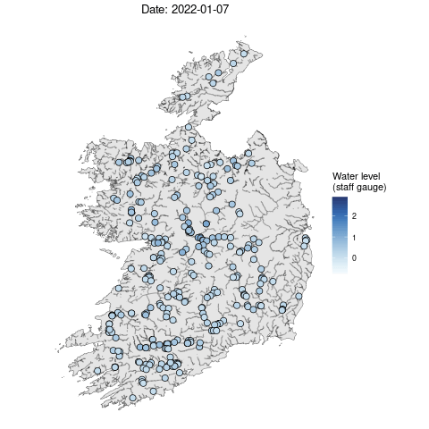
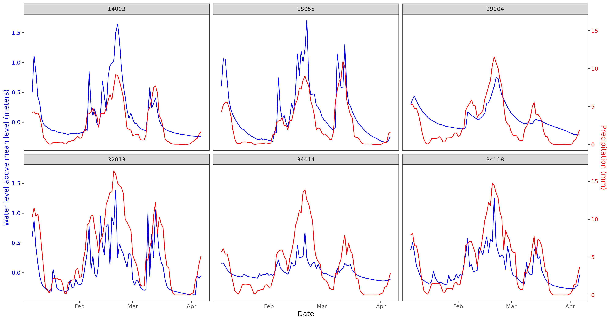
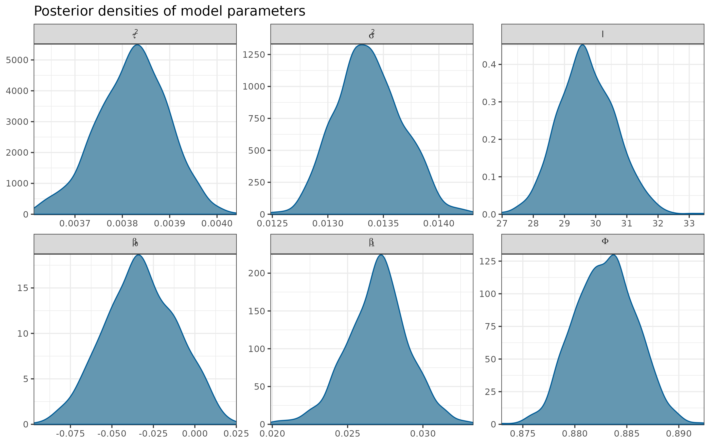
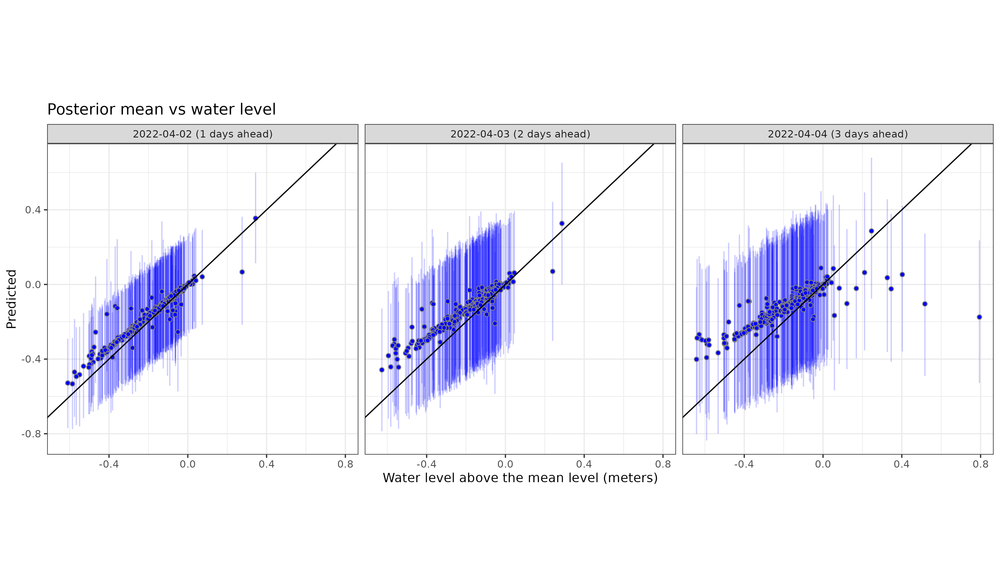
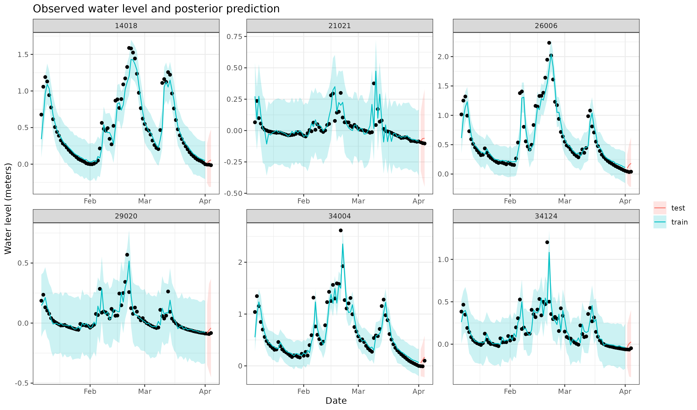
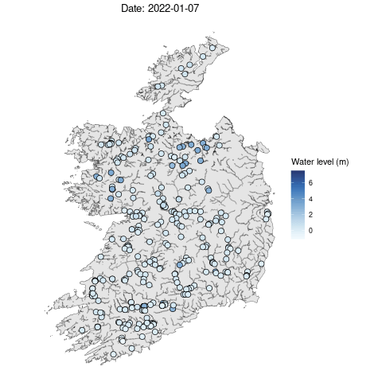

```{r, cache=FALSE, include=FALSE}
options(htmltools.dir.version = FALSE)

source("config/setup_knitr.R")
library(RefManageR)
BibOptions(check.entries = FALSE,
           bib.style = "authoryear",
           cite.style = "authoryear",
           style = "markdown",
           max.names = 2,
           hyperlink = FALSE,
           dashed = FALSE)
bib <- ReadBib("config/refs.bib", check = FALSE)
xaringanExtra::use_xaringan_extra("tachyons")

library(plotly)
```

class: title-slide, sydney-blue
background-image: url("config/CRT_uni_funding.png"), url("config/CRT_logo.png")
background-position: 10% 100%, 85% 99%
background-size: 47%, 30%

<br>
.center[.font200[.white[Spatiotemporal prediction of daily river levels in Ireland using nearest neighbor Gaussian processes]]]

<br>
.center[.black[
.large[Victor Nagahama<sup>1</sup> Niamh Cahill<sup>1</sup> James Sweeney<sup>2</sup>]

.small[<sup>1</sup>Maynooth University <sup>2</sup>University of Limerick]

<br>
21/06/2024
]]

---
# Outline

- Motivation
- Nearest Neighbor Gaussian Process (NNGP)
- Irish river data
- Proposed model & results
- Future work
---

# Motivation
.pull-left[

]

.pull-right[
- Area: 70,273 $\textrm{km}^2$
- 301 river stations
- 07/01/2022 to 06/04/2022 (90 daily records)
- Auxiliary variables: precipitation
]

---
# Gaussian Process

Consider a (Gaussian) spatial process $\boldsymbol{x}(\boldsymbol{s})$ in the spatial domain $\mathcal{S} \subset \mathcal{R}^d$ for the reference locations $\boldsymbol{s} = \{\mathcal{s}_1, \dots, \mathcal{s}_n\}$. The multivariate density can be factorized as  

$$p(\boldsymbol{x}) = p(x(\boldsymbol{s}_1)) \prod_{i = 2}^n p(x(\boldsymbol{s}_i) \mid x(\boldsymbol{s}_1), \dots, x(\boldsymbol{s}_{i - 1}))$$

--
## Nearest Neighbor Gaussian Process (NNGP)

For a large number of spatial points, the conditional densities have superfluous information in a way it can be equivalent to condition by smaller sets `r Citep(bib, c("Vecchia1988", "Datta2016"))`.

$$p(\boldsymbol{x}) \approx p(\widetilde{\boldsymbol{x}}) = p(x(\boldsymbol{s}_1)) \prod_{i = 2}^n p(x(\boldsymbol{s}_i) \mid x(N(\mathcal{s}_i)))$$
where $N(\boldsymbol{s}_i)$ is the subset with at most $m$ nearest neighbors of $\boldsymbol{s}_i$ in $\boldsymbol{s}_i = \{\boldsymbol{s}_1, \dots, \boldsymbol{s}_{i - 1}\}$.

---
# Steps

```{r, echo=FALSE}
plot_cond_set <- readRDS("./data/conditional_set.rds")
```

.pull-left[
```{r, plot_cond_set, cache=TRUE}
ggplotly(plot_cond_set, height = 520, width = 500) |>
  animation_opts(
    frame = 1500,
    transition = 0,
    redraw = FALSE
  ) |>
  animation_slider(currentvalue = list(prefix = "Location ",
                                       font = list(color = "black"))) |>
  config(staticPlot = TRUE)
```
]

.pull-right[
1. Order the locations (according to one of the coordinates)
]

---
count: false
# Steps

.pull-left[
```{r, plot_cond_set}
```
]

.pull-right[
1. Order the locations (according to one of the coordinates)
2. Find the neighbor sets $N(\boldsymbol{s}_i)$
]

---
count: false
# Steps

.pull-left[
```{r, plot_cond_set}
```
]

.pull-right[
1. Order the locations (according to one of the coordinates)
2. Find the neighbor sets $N(\boldsymbol{s}_i)$
3. Compute the conditional densities
$$p(x(\boldsymbol{s}_i) \mid \boldsymbol{x}(N(\boldsymbol{s}_i))) \sim \mathcal{N} \left( \boldsymbol{a}_i \boldsymbol{x} \left( N(\boldsymbol{s}_i) \right), d_i \right) \\
\boldsymbol{a}_i = \boldsymbol{C}_{\boldsymbol{s}_i, N(\boldsymbol{s}_i)} \boldsymbol{C}^{-1}_{N(\boldsymbol{s}_i)} \\
d_i = \boldsymbol{C}_{\boldsymbol{s}_i} - \boldsymbol{a}_i \boldsymbol{C}^\intercal_{\boldsymbol{s}_i, N(\boldsymbol{s}_i)}$$
]

---
count: false

# Steps
.pull-left[
```{r, plot_cond_set}
```
]

.pull-right[
1. Order the locations (according to one of the coordinates)
2. Find the neighbor sets $N(\boldsymbol{s}_i)$
3. Compute the conditional densities
$$p(x(\boldsymbol{s}_i) \mid \boldsymbol{x}(N(\boldsymbol{s}_i))) \sim \mathcal{N} \left( \boldsymbol{a}_i \boldsymbol{x} \left( N(\boldsymbol{s}_i) \right), d_i \right) \\
\boldsymbol{a}_i = \boldsymbol{C}_{\boldsymbol{s}_i, N(\boldsymbol{s}_i)} \boldsymbol{C}^{-1}_{N(\boldsymbol{s}_i)} \\
d_i = \boldsymbol{C}_{\boldsymbol{s}_i} - \boldsymbol{a}_i \boldsymbol{C}^\intercal_{\boldsymbol{s}_i, N(\boldsymbol{s}_i)}$$
4. Obtain the approximation for $p(\boldsymbol{x})$
$$p(\widetilde{\boldsymbol{x}}) = p(x(\boldsymbol{s}_1)) \prod_{i = 2}^n p(x(\boldsymbol{s}_i) \mid x(N(\mathcal{s}_i)))$$
]


---
count: false

# Steps
.pull-left[
```{r, plot_cond_set}
```
]

.pull-right[
1. Order the locations (according to one of the coordinates)
2. Find the neighbor sets $N(\boldsymbol{s}_i)$
3. Compute the conditional densities
$$p(x(\boldsymbol{s}_i) \mid \boldsymbol{x}(N(\boldsymbol{s}_i))) \sim \mathcal{N} \left( \boldsymbol{a}_i \boldsymbol{x} \left( N(\boldsymbol{s}_i) \right), d_i \right) \\
\boldsymbol{a}_i = \boldsymbol{C}_{\boldsymbol{s}_i, N(\boldsymbol{s}_i)} \boldsymbol{C}^{-1}_{N(\boldsymbol{s}_i)} \\
d_i = \boldsymbol{C}_{\boldsymbol{s}_i} - \boldsymbol{a}_i \boldsymbol{C}^\intercal_{\boldsymbol{s}_i, N(\boldsymbol{s}_i)}$$
4. Obtain the approximation for $p(\boldsymbol{x})$
$$p(\widetilde{\boldsymbol{x}}) = p(x(\boldsymbol{s}_1)) \prod_{i = 2}^n p(x(\boldsymbol{s}_i) \mid x(N(\mathcal{s}_i)))$$

Computational cost: $\mathcal{O}(n \times m^2)$
]

---
# Ireland river data

## Pre-processing
- Moving average of precipitation
- Computed water level above the mean level (centering)

```{r, echo=FALSE, out.width='65%'}

```

---
# Proposed model

Let $\boldsymbol{y}_t$ represent the vector of water level measurements of available stations at time $t$. We define a model as:

$$\boldsymbol{y}_t \mid \boldsymbol{y}_{t - 1} = \boldsymbol{X}_t \boldsymbol{\beta} + \phi (\boldsymbol{y}_{t - 1} - \boldsymbol{X}_{t - 1} \boldsymbol{\beta}) + \boldsymbol{\epsilon}_t, \quad t > 1 \\
\boldsymbol{y}_1 = \boldsymbol{X}_1 \boldsymbol{\beta} + \boldsymbol{\epsilon}_1, \quad \boldsymbol{\epsilon}_1 \sim N \left(\boldsymbol{0}, \frac{\boldsymbol{\Sigma} + \tau^2 I}{1 - \rho^2} \right) \\
\boldsymbol{\epsilon}_t \sim \mathcal{N}(\boldsymbol{0}, \boldsymbol{\Sigma} + \tau^2 I)$$

--
- Extensions to spatially varying slopes: $\beta_1 \sim \mathcal{N}(b_0, \boldsymbol{\Sigma}_{\beta_1})$

---
# Posterior densities of model parameters

```{r, echo=FALSE, out.width='80%'}

```

---
# Out-of-sample prediction

```{r, echo=FALSE, out.width='85%'}

```

---
# Out-of-sample prediction

```{r, echo=FALSE, out.width='80%'}

```


.pull-right[
<!-- TS -->
]

<!-- Exceedance probability -->

---
# Future work

- Include additional predictors such as evaporation and soil saturation.

--
- Consider nonlinear functions to improve the relationship between response and predictors

--
- Incorporate covariance structures that considers the branching stream network and flow connectivity `r Citep(bib, "VerHoef2010")`

---
# References
```{r, results='asis'}
PrintBibliography(bib)
```

---
class: sydney-blue, center, middle, inverse
# .white[Thank you!]

.pull-left[
<br>
<br>
<br>
<br>
.black[victor.nagahama.2022@mumail.ie]
]

.pull-right[

]
